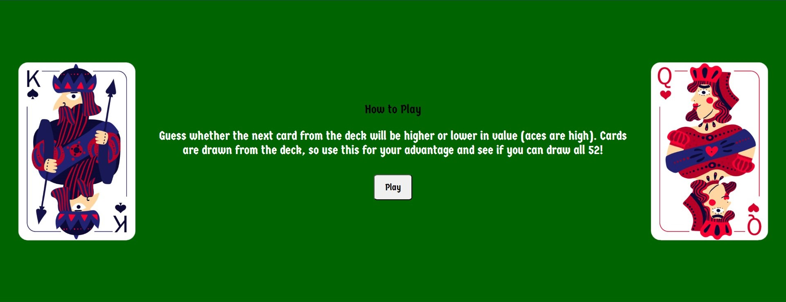
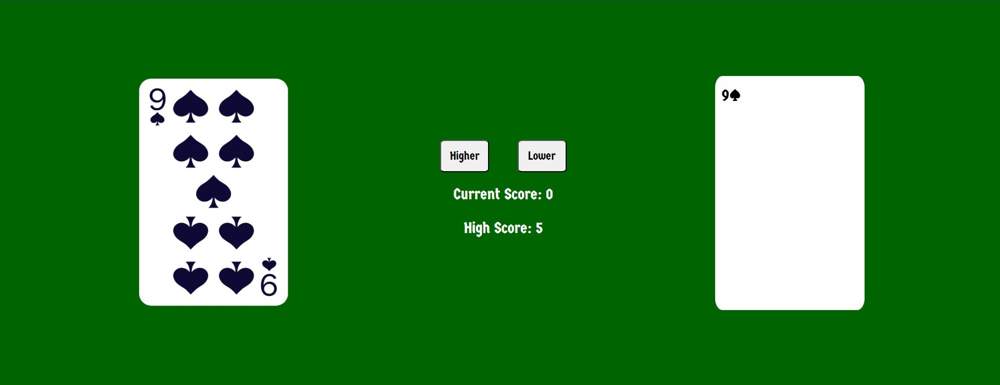
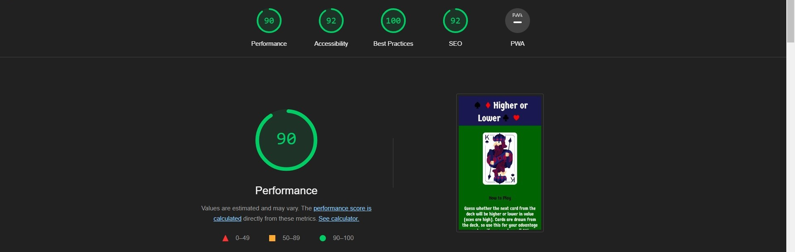

# Higher or Lower

Higher or lower is a game website that lets users play the classic card game of higher or lower. Simply predict whether the next card drawn from the deck will be higher or lower in value than the previous one. 

The site can be used by anyone of any age, though the cartoonish style of picture cards and simple nature of the game would make it well suited for younger children.

## Features

- ### Header
  - The header is clear and concise in stating the name of the game.

  - Its color theme is consistent with the colors of the picture cards. 

- ### How to Play
  - This area of text tells new users unfamiliar with the game, in a clear way, the simple rules of the game.

  - This area also contains a play button, targeted with javascript, to change the ‘How to Play’ area into the main game with a click from the user.

- ### Game Area
  - The left side of this area shows the currently drawn card to the user. The card pictures have been chosen for their attractive design.

  - There are two buttons for user input, a ‘Higher’ and a ‘Lower’ button, designed to be simple to use and consistent in color theme with website.

  - A score area keeps track of the user’s current score and a user high score, saved by the browser, adds an incentive for the user to keep playing and to come back to the website.

  - On the right side is a container, styled like a playing card, that shows the user what cards have been drawn. This helps the user in making their next guess.

- ### Game Play
  - When the game area loads, a random card is drawn from a created card deck using javascript.

  - When the user enters an input by clicking on the ‘Higher’ or ‘Lower’ button, another random card is drawn. The values of the current card and previous card are then compared to see if the user’s guess was correct. 

- ### Footer
  - The footer holds a link to the original source of the card images.

  - The footer, like the header, is consistent in color theme with the picture cards.

## Testing
- I tested the page works in different browsers: Chrome, Firefox, Edge.

- I confirmed the game results are always correct.

- I have confirmed the text across the site is readable and understandable.

- I have confirmed the website works and looks good across the standard screen sizes using developer tools.

### Bugs

### Validator Testing
  - HTML
    
    - No errors were returned when passing through the official [W3C validator](https://validator.w3.org/nu/?doc=https%3A%2F%2Fmwbark.github.io%2FHigher-or-Lower%2F)

  - CSS

    - No errors were returned when passing through the official [(jigsaw) validator](https://jigsaw.w3.org/css-validator/validator?uri=https%3A%2F%2Fmwbark.github.io%2FHigher-or-Lower%2F&profile=css3svg&usermedium=all&warning=1&vextwarning=&lang=en)

  - Accessibility

    - I confirmed the colors and fonts chosen are accessible by running it through lighthouse in devtools

### Unfixed Bugs

## Deployment

- The site was deployed to GitHub pages. The steps to deploy are as follows:

  - In the GitHub repository, navigate to the Settings tab

  - Click on 'Pages' on the left side menu

  - In the dropdown menu under 'Branch' select 'main'

  - Return to the repository. On the right of the screen click on 'Deployments'

  - The page link will be shown under 'github-pages'

The live link can be found here - [Higher or Lower](https://mwbark.github.io/Higher-or-Lower/)

## Credits

### content
- The script to create the deck array was adapted from Microsoft co-pilot 'Create an array in javascript containing playing cards' suggestion.

- The html and script for the 'Higher' and 'Lower' buttons was adapted from Microsoft co-pilot 'Create input buttons for a game of higher or lower' suggestion.

- How to create webstorage was taken from [w3Schools](https://www.w3schools.com/html/html5_webstorage.asp).

- Fixing JSHint warning was taken from [stackoverflow](https://stackoverflow.com/questions/27441803/why-does-jshint-throw-a-warning-if-i-am-using-const).

### media
- The playing card images (as noted in the website footer) were taken from [Freepik](https://www.freepik.com/free-vector/full-deck-poker-playing-cards_6086127.htm#query=paly%20card&position=11&from_view=author&uuid=940f919e-674b-47bc-836d-8c95234672db)